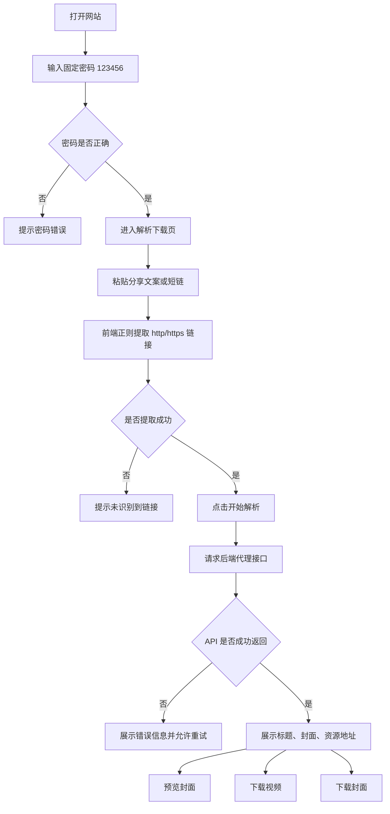

## 1. 产品概述
这是一个面向普通用户的抖音去水印下载网站，用户通过固定密码进入页面后，粘贴分享文案或短链即可解析视频标题、封面和无水印资源。
- 目标是提供低门槛、无需注册的解析与下载体验，减少用户从分享文案中手动找链接和提取资源的成本。
- 产品价值在于以极简流程完成“输入分享内容 -> 提取链接 -> 解析资源 -> 下载视频/封面”的闭环。

## 2. 核心功能

### 2.1 功能模块
1. **密码验证页**：输入固定密码 `123456`，验证通过后进入主页面，并在当前会话内保持通过状态。
2. **解析下载页**：粘贴抖音分享文案，自动用正则提取 `http` 或 `https` 链接，点击“开始解析”后展示结果。
3. **结果展示区**：展示标题、封面图、视频地址、封面地址，并提供预览和下载按钮。

### 2.2 页面详情
| 页面名称 | 模块名称 | 功能说明 |
|-----------|-------------|---------------------|
| 密码验证页 | 密码输入区 | 用户输入固定密码，校验成功后进入主页面，失败时给出明确提示 |
| 密码验证页 | 产品说明区 | 展示站点用途、支持的输入方式、隐私与使用提醒 |
| 解析下载页 | 链接输入区 | 支持用户粘贴完整分享文案，前端通过正则提取第一个有效 `http/https` 链接 |
| 解析下载页 | 解析操作区 | 点击“开始解析”后请求后端代理接口，展示加载态、失败态、重试入口 |
| 解析下载页 | 解析结果卡片 | 展示标题、封面预览、视频资源地址、封面资源地址、内容类型 |
| 解析下载页 | 下载操作区 | 通过前端 `fetch + blob + a[download]` 下载视频和封面 |
| 解析下载页 | 结果提示区 | 对空输入、未提取到链接、API 异常、下载失败等情况给出提示 |

## 3. 核心流程
用户先输入固定密码进入网站，随后粘贴抖音分享文案。系统从文本中提取可用短链，点击解析后调用后端代理接口获取标题、封面和无水印视频地址，再由前端完成资源下载。

## 4. 用户界面设计
### 4.1 设计风格
- 主色：深墨黑、钴蓝、电光青，形成偏科技感的夜间界面
- 强调色：高亮青绿用于按钮、输入焦点和数据状态
- 按钮风格：大圆角、半透明描边、悬浮发光反馈
- 字体：标题使用有辨识度的中文展示字体，正文使用清晰易读的无衬线字体
- 布局风格：桌面优先的单页工作台布局，左侧输入操作，右侧结果预览
- 图标建议：简洁线性图标，搭配少量状态徽标

### 4.2 页面设计概览
| 页面名称 | 模块名称 | UI 元素 |
|-----------|-------------|-------------|
| 密码验证页 | 验证卡片 | 居中卡片、渐变光晕背景、密码输入框、显著主按钮、错误提示 |
| 密码验证页 | 说明区域 | 简短说明文字、支持场景标签、注意事项文案 |
| 解析下载页 | 顶部说明栏 | 产品标题、副标题、当前状态标签、清空入口 |
| 解析下载页 | 输入面板 | 多行文本框、解析按钮、示例文案、输入合法性提示 |
| 解析下载页 | 结果卡片 | 标题区、封面大图、链接字段、下载按钮组、加载骨架态 |
| 解析下载页 | 下载区域 | 视频下载按钮、封面下载按钮、复制地址按钮、成功提示 |

### 4.3 响应式设计
- 采用桌面优先设计，兼容移动端自适应
- 桌面端使用双栏布局，移动端折叠为纵向单栏
- 输入框、按钮和下载区域需兼顾触控点击尺寸
- 封面预览图在小屏下保持合适纵横比，避免遮挡关键信息

### 4.4 内容与交互约束
- 密码仅做轻量访问限制，不引入注册、登录、找回密码流程
- 分享文案解析优先提取第一个 `http/https` 链接
- 当接口返回 `content.type` 为 `VIDEO` 时优先展示视频下载
- 当接口无封面或无视频地址时，需要明确显示缺失状态，避免空白区域
