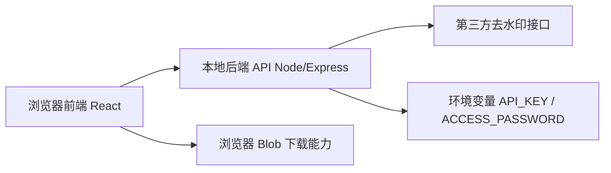
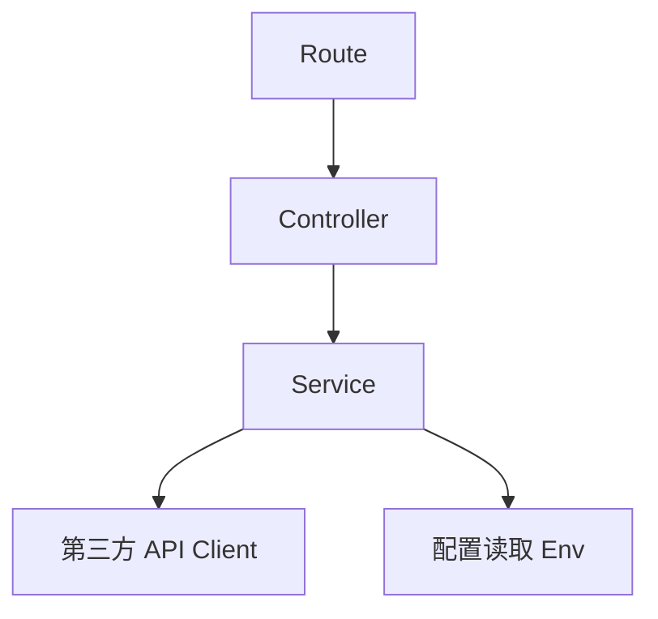

## 1. 架构设计
本项目采用前后端分离的轻量架构。前端负责密码验证、链接提取、结果展示和浏览器下载；后端负责保存第三方 API 秘钥并代理解析请求，避免将秘钥直接暴露到浏览器。



## 2. 技术描述
- 前端：React@18 + TypeScript + Vite + Tailwind CSS@3
- 后端：Node.js + Express
- 初始化工具：Vite
- 状态管理：React 内置状态管理
- 网络请求：浏览器 `fetch`
- 下载实现：`fetch -> Blob -> ObjectURL -> a[download]`
- 配置管理：前后端统一通过 `.env` 管理，前端仅保留公开配置，第三方 API 秘钥仅放后端

## 3. 路由定义
| 路由 | 用途 |
|-------|---------|
| / | 单页应用入口，包含密码验证、链接解析、结果展示与下载操作 |
| /api/verify-password | 校验固定密码是否正确 |
| /api/parse | 接收前端提取后的抖音链接，调用第三方去水印接口并返回标准化结果 |

## 4. API 定义

### 4.1 前端提交密码
```ts
type VerifyPasswordRequest = {
  password: string;
};

type VerifyPasswordResponse = {
  success: boolean;
  message: string;
};
```

### 4.2 前端发起解析
```ts
type ParseRequest = {
  link: string;
};

type ParseResult = {
  title: string;
  cover: string;
  url: string;
  type: string;
  originalLink: string;
};

type ParseResponse = {
  success: boolean;
  message: string;
  data?: ParseResult;
};
```

### 4.3 第三方接口映射策略
- 后端调用地址格式：
  `https://api.guijianpan.com/waterRemoveDetail/xxmQsyByAk?ak={API_KEY}&link={ENCODED_LINK}`
- 从第三方返回中提取：
  - `content.title` -> `title`
  - `content.cover` -> `cover`
  - `content.url` -> `url`
  - `content.type` -> `type`
  - `content.originText` 或原始链接 -> `originalLink`
- 若第三方返回 `code !== "10000"` 或 `content.success !== true`，后端统一转成前端可直接展示的错误结构

## 5. 服务端架构图


## 6. 数据模型
本项目不引入数据库。密码为固定值 `123456`，通过服务端环境变量或默认值管理；解析结果按请求实时获取，不做持久化存储。

### 6.1 运行时数据结构
```ts
type SessionState = {
  verified: boolean;
};
```

### 6.2 配置定义
```env
API_KEY=你的秘钥
ACCESS_PASSWORD=123456
PORT=3000
```

## 7. 核心实现约束
- 前端必须支持从分享文案中通过正则提取 `http` 或 `https` 链接
- 密码校验请求走后端接口，避免把固定密码硬编码在前端逻辑里作为唯一判断依据
- 第三方接口秘钥只能存在服务端环境变量中，不允许直接暴露到浏览器请求地址
- 下载动作必须由前端触发，满足“前端方式下载视频和封面”的要求
- 前端需处理跨域下载失败场景：优先抓取 Blob，若资源端阻止下载，则给出“打开资源地址”兜底方式
- 对解析中、解析成功、解析失败、空状态分别设计明确反馈

## 8. 风险与处理
- 第三方资源地址可能存在跨域限制：优先使用 Blob 下载，失败时回退到新窗口打开资源
- 抖音分享文案格式可能不固定：正则提取只取第一个合法 `http/https` 链接，并在前端显示提取结果
- 固定密码属于轻量保护，不适合作为强安全方案；当前需求明确无需完整登录体系，因此保留该实现
